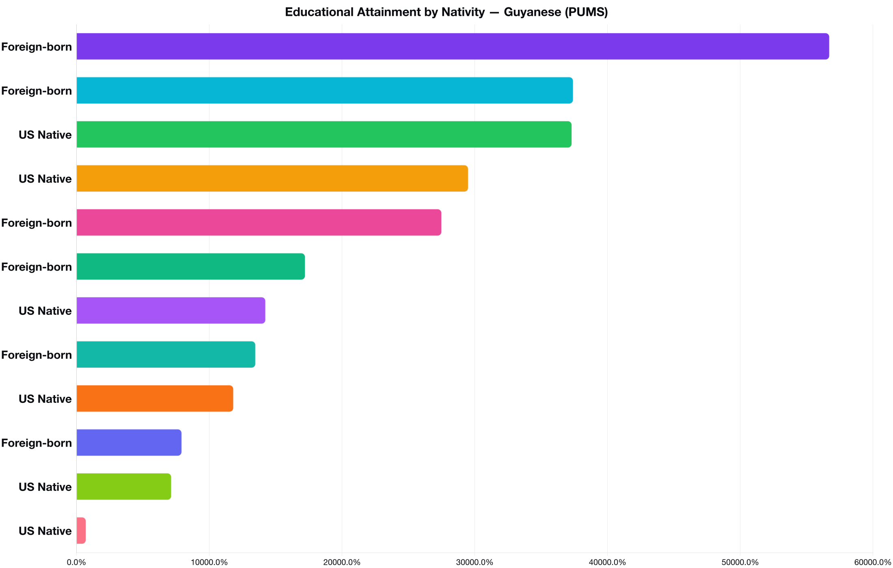
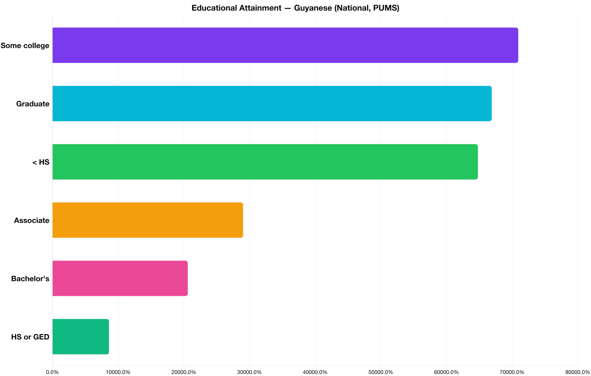

# Education

_Source: [U.S. Census Bureau, ACS Public Use Microdata Sample (PUMS), 2023](https://www.census.gov/programs-surveys/acs/microdata.html)_

_Source: [U.S. Census Bureau, ACS Public Use Microdata Sample (PUMS), 2023](https://www.census.gov/programs-surveys/acs/microdata.html)_

_Source: [U.S. Census Bureau, ACS PUMS, 2023](https://www.census.gov/programs-surveys/acs/microdata.html)_

_Source: [U.S. Census Bureau, ACS PUMS, 2023](https://www.census.gov/programs-surveys/acs/microdata.html)_

_Source: [U.S. Census Bureau, ACS PUMS, 2023](https://www.census.gov/programs-surveys/acs/microdata.html)_

_Source: [U.S. Census Bureau, ACS PUMS, 2023](https://www.census.gov/programs-surveys/acs/microdata.html)_

_Source: [U.S. Census Bureau, ACS PUMS, 2023](https://www.census.gov/programs-surveys/acs/microdata.html)_

_Source: [U.S. Census Bureau, ACS PUMS, 2023](https://www.census.gov/programs-surveys/acs/microdata.html)_

_Source: [U.S. Census Bureau, ACS PUMS, 2023](https://www.census.gov/programs-surveys/acs/microdata.html)_

_Source: [U.S. Census Bureau, ACS PUMS, 2023](https://www.census.gov/programs-surveys/acs/microdata.html)_
