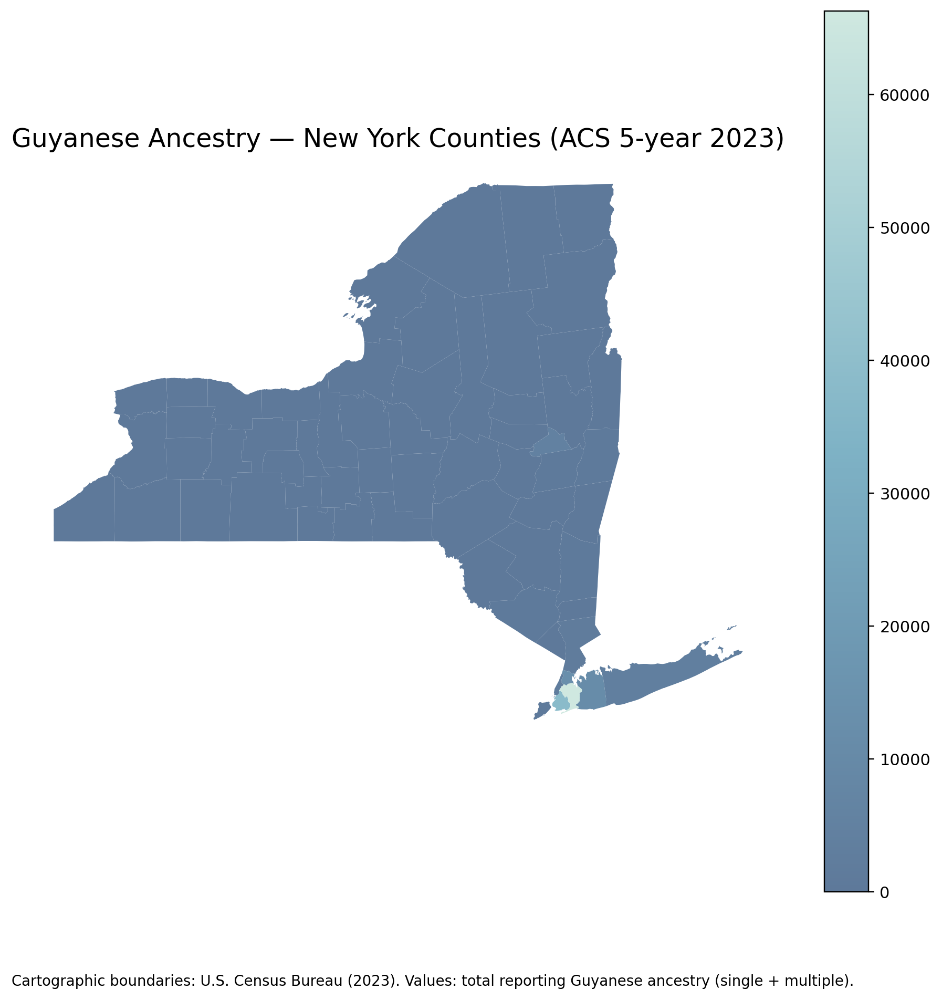

# General Figures

_Source: [U.S. Census Bureau, American Community Survey (ACS), 2023](https://data.census.gov/)_

_Source: [U.S. Census Bureau, American Community Survey (ACS), 2023](https://data.census.gov/)_

_Source: [U.S. Census Bureau, American Community Survey (ACS), 2023](https://data.census.gov/)_

_Source: [U.S. Census Bureau, American Community Survey (ACS), 2023](https://data.census.gov/)_

_Source: [U.S. Census Bureau, American Community Survey (ACS), 2023](https://data.census.gov/)_

_Source: [U.S. Census Bureau, American Community Survey (ACS), 2023](https://data.census.gov/)_

_Source: [U.S. Census Bureau, American Community Survey (ACS), 2023](https://data.census.gov/)_

_Source: [U.S. Census Bureau, American Community Survey (ACS), 2023](https://data.census.gov/)_

_Source: [U.S. Census Bureau, American Community Survey (ACS), 2023](https://data.census.gov/)_
